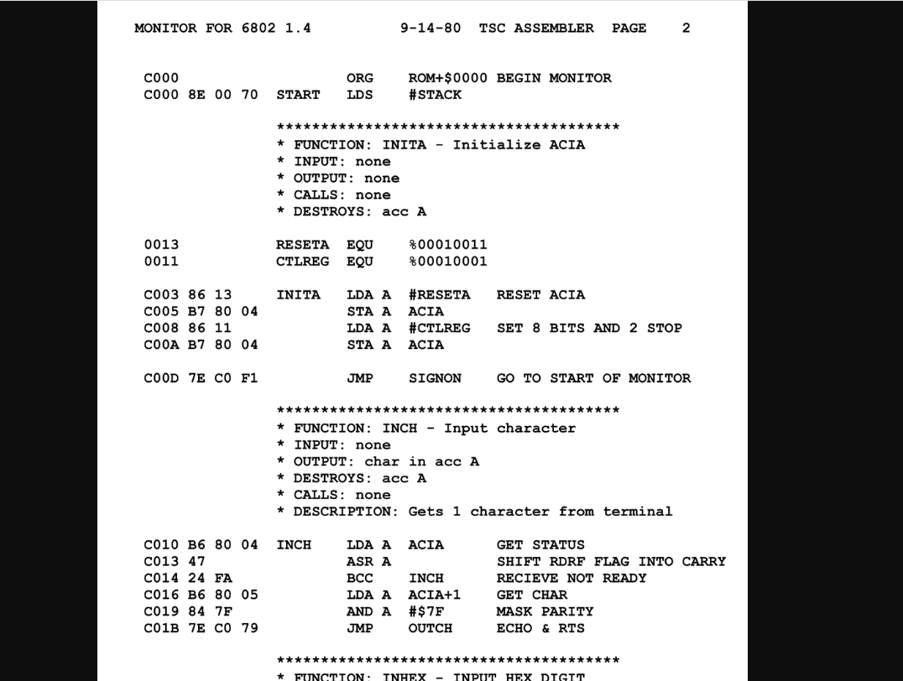
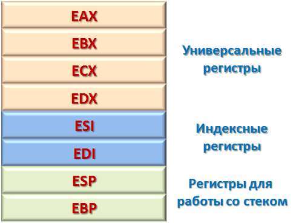

# Обратное проектирование. Анализ потоков данных. Дизассемблирование

## Обратное проектирование

Обратное проектирование — метод разборки объекта, который помогает понять, как сконструировано ранее созданное устройство, процесс, система или часть программного обеспечения. Инженер разбирает продукт на части, чтобы понять, как он работает, а потом воссоздать похожее или идентичное решение. Разработчик отвечает на вопрос: «Какие процессы провоцируют именно такое поведение продукта?».

Таким способом не удастся получить точный исходный код, но инженеры смогут понять общую логику работы и повторить функционал.

Часто встречаются названия «обратное проектирование», «обратный инжиниринг», «реверс-инжиниринг» — они означают одно и то же.

### Для чего используют обратное проектирование

- Поиск и исправление ошибок в программах, к исходному коду которых у разработчиков нет доступа
- Анализ вирусов для создания антивирусного программного обеспечения
- Улучшение функциональности приложения, когда связаться с предыдущим разработчиком не получается — например, компания-разработчик перестала существовать
- Описание механики игры, когда разработчик берет в пример существующую игру, наблюдает за ее развитием, анализирует сценарий и предлагает свой вариант
- Обучение: если разработчик не понимает какую-то часть своего продукта, он может проанализировать чужую и сделать выводы о ее функционировании

Реверс-инжиниринг также применяют для нелегальных целей — кражи кода, обхода технических средств защиты авторских прав, бесконечного использования бесплатных версий приложения.

### Преимущества

- Обратный инжиниринг позволяет увидеть то, что уже есть: любые части, структуры или процессы, которые могли бы принести пользу для разработки. Изучение существующих продуктов приводит к инновациям и открытиям.
- Также процесс помогает находить недостатки и уязвимости в продукте. Это необходимо, чтобы обеспечить безопасность пользователей. Лучше, чтобы проблема возникла на этапе исследования, а не на этапе распространения.
- Кроме того, благодаря обратной разработке на рынок выходят менее дорогие продукты — затраты на создание снижаются.

### Недостатки

Разработчик не сможет полностью вернуть приложение в исходное состояние перед компиляцией. Кроме того, сложно переиспользовать код из дизассемблированного приложения  из-за обфускации  критического и важного исходного кода. Иногда разработчики загружают в приложение нерелевантный код, чтобы сбить с толку реверс-инженера и еще больше усложнить реверсирование.

### Законность реверс-инжиниринга

Коммерческие лицензионные соглашения запрещают реверс-инжиниринг, хотя метод законен.

В США было много судебных прецедентов о реверс-инжиниринге в попытках обойти защиту игровых консолей. Некоторые компании (SEGA, Nintendo и другие) хотели, чтобы у них покупали допуски к консолям и выпускали эксклюзивные игры. Разработчикам игр это не нравилось, ведь проще не покупать лицензию и выпускать игры для всех. Поэтому они находили способы обойти защиту игровых консолей: игры становились общедоступными и совместимыми с консолями.

В 1980-90-х гг. появились первые судебные разбирательства о реверс-инжиниринге и сформировались принципы: авторское право не защищает идеи, процессы и операции, для их защиты нужно использовать патентное право.

С тех пор обратная разработка — законна, если работа требует такого подхода для понимания идей и процессов. Но для этого следует использовать копию продукта, полученную легальным путем.

Если бы реверсную разработку запретили, владелец продукта и кода был бы монополистом на рынке.

## Анализ потоков данных

Анализ потоков данных (или стрим-анализ) - это процесс наблюдения, обработки и анализа данных, поступающих в систему в режиме реального времени. Это может включать в себя данные из различных источников, таких как датчики, сети, социальные медиа, онлайн-транзакции и многое другое. Анализ потоков данных играет важную роль в различных областях, включая финансы, маркетинг, медицину, телекоммуникации, искусственный интеллект и другие.

Значение анализа потоков данных заключается в способности быстро реагировать на изменения в данных, выявлять аномалии, выявлять новые тренды и делать предсказания на основе актуальной информации. Это позволяет организациям принимать более обоснованные решения в реальном времени, что может привести к повышению эффективности и конкурентоспособности.

## Ассемблер

Язык ассемблера (от англ. assembly language) — это императивный язык низкого уровня, который используется для представления команд CPU. При этом команды процессора остаются читабельными для программиста. Под термином "ассемблер" также может подразумеваться ПО, которое преобразует соответствующий исходный код в машинный код. Обратный процесс (конвертация машинного кода в ассемблер-код) выполняет дизассемблер.

Простыми словами, язык ассемблера — это низкоуровневый язык, позволяющий программисту обращаться непосредственно к процессору машины.

Это самый низкоуровневый человекочитаемый язык программирования. Сегодня он используется для точного управления процессором и памятью на «голом» железе. Важно отметить: нет единого языка ассемблера. Существует множество таких языков.

Языки разнятся в зависимости от архитектуры, на которой функционирует машина (например, x86, x32, ARM или PowerPC).



### Процессор и память

Компьютеры состоят из множества аппаратных средств. Самым важным из них является процессор (CPU), который способен выполнять вычисления. Процессор состоит из множества компонентов, например, схем для выполнения основных математических операций (ALU и FPU) и регистров. Регистры можно представить как небольшие ячейки, в которых хранится горстка небольших чисел. 



Проблема в том, что процессор не понимает ассемблер. Слова и буквы типа "mov eax, 5" — ничего не значат для него. CPU понимает только двоичные числа, которые показывают ему то, что он должен делать со своим оборудованием. Это и есть машинный код. И у процессоров разных производителей свой набор таких чисел и команд.

### Принцип работы

Представьте, что у нас простой компьютер: он считывает три числа за один раз и далее решает, что делать. Первое прочитанное число — может сказать процессору, какую команду нужно выполнить. Например:

0 — сложить два числа вместе, используя аппаратное обеспечение ALU.

1 — поместить некоторое постоянное число в регистр.

2 — выполнить следующую команду, только если определенный регистр имеет определенное значение.

3 — заставить динамики воспроизвести звуковой сигнал.

... и так далее.

Следующие два числа, которые считывает компьютер, могут сообщить ему аргументы команды. Например, когда он видит число 0, которое означает «сложить два числа», следующие два числа могут означать, какие именно два регистра компьютер должен сложить. Помните, регистры — это просто маленькие ячейки, в которых хранятся числа. Например:

0 [команда] 3 [первый аргумент] 1 [второй аргумент] — добавить число в регистре №3 к числу в регистре №1 и поместить ответ в специальный регистр №0 

Запоминание того, какое число что делает — может надоесть, а программа, представляющая собой просто набор чисел — станет очень запутанной. Вместо этого — мы можем создать код на языке ассемблера, который поможет убить всех зайцев сразу. В нашем языке не будут использоваться только нули и единицы, а будут также команды add (добавить) и put (поместить). Например, так:

add 3 1 = 0 3 1 (сложить регистры 3 и 1).

put 7 3 = 1 7 3 (поместить число 7 в регистр 3).

check 4 5 = 2 4 5 (проверить, что регистр 4 равен 5, и только в этом случае запустить следующую строку).

beep = 3 0 0 — воспроизвести звуковой сигнал. 

#### PDP11

```
dep 2000 clr r0
dep 2002 mov #3000, r0
dep 2006 add (r0), 4(r0)
dep 2012 bvs 2034
dep 2014 add 2(r0), 4(r0)
dep 2022 bvs 2034
dep 2024 add #2, r0
dep 2030 jmp 2006
dep 2034 0

dep 3000 1
dep 3002 1
```

#### i8086gui

```
org 100h

mov bx, data
loop:
  mov ax, word [bx]
  add ax, word [bx+2]
  jc end
  mov word [bx+4], ax
  add bx, 2d
  jmp loop

end:
  jmp end

data: dw 1d, 1d
```
